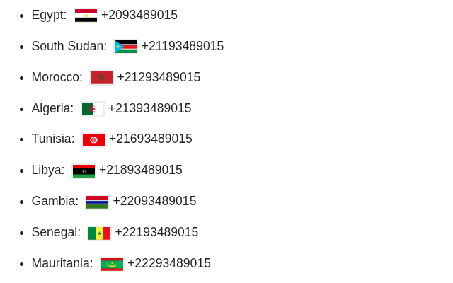

# Introduction

Show country flags near international phone numbers.

# Features

* [x] All places covered in [this Wikipedia link](https://en.wikipedia.org/wiki/List_of_telephone_country_codes).
* [x] Works for various formats, such as with/without plus, hyphens,
  spaces or leading 00.
* [x] State code for each state of the USA

This is what it looks like:

